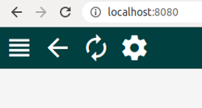
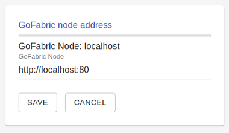
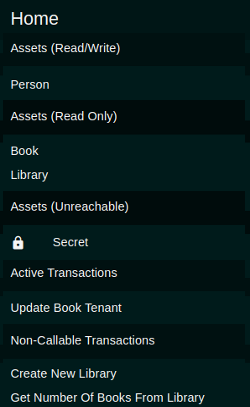
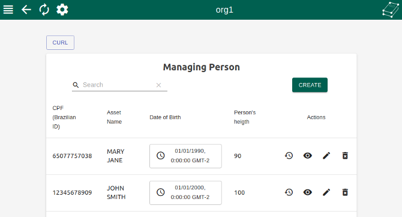
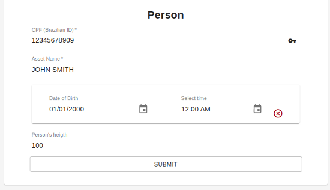
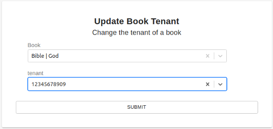

# Testing

**GoLedger CC-Tools** has different ways for testing the source code in development mode.

For **GoLang** syntax checking, execute the following command:

```sh
cd chaincode \
go vet
```

After the succesfull code instantiation or update, you can check the logs directly inside the **chaincode** execution **peers** containers. These containers can be identified by starting with `dev`.

```sh
docker logs dev-peer0.org1.example.com-cc-tools-demo-0.1
```

## Using cc-webclient

To perform the tests and integrations satisfactorily, it is suggested the usage of **cc-webclient** tool. After finishing the steps, it is suggested to execute the following commands to create 3 applications in order to connect with **org1, org2 and org3**.

```sh
./run-cc-web.sh 8080 & \
./run-cc-web.sh 8090 & \
./run-cc-web.sh 8100 &
```

## Configuring rest-server and cc-webclient

After executing **cc-webclient** containers, the applications can be accessed directly through the ports defined in the script. E.g.: 8080, 8090, 8100

After accessing **cc-webclient** through the browser, the configuration of rest server address can be done by clicking on the tool icon.



Accesses are can be made with the following settings:

- `org1`: **http://localhost:80**
- `org2`: **http://localhost:980**
- `org3`: **http://localhost:1080**



**cc-webclient** application has a sidebar that shows the available **assets** as well as the **transactions** registered in the chaincode.



## Endpoint usage

The rest-server endpoint usage is shown using the **CURL** buttons.


For each screen, you can check endpoint usage pressing the `curl` button.

For example, on the asset creation screen:


## List, create, edit, delete or history an asset

To **list** each asset, just select an asset in the sidebar.



Selecting the `CREATE` button at the asset list window, an asset **creation** screen will appear.

For example, for the **Person** asset



The **edit** screen is accessed by selecting the **edit icon** in an asset's list window.

The **removal** of an asset is requested by selecting the **delete icon** in the asset's list window.

The **history** of an asset (all changes recorded in the ledger) can be viewed by selecting the **history icon** in an asset's window.

## Executing an transaction

The **transaction** execution can be performed by selecting the transaction in the sidebar.

For example, for transaction **UpdateBookTenant**



